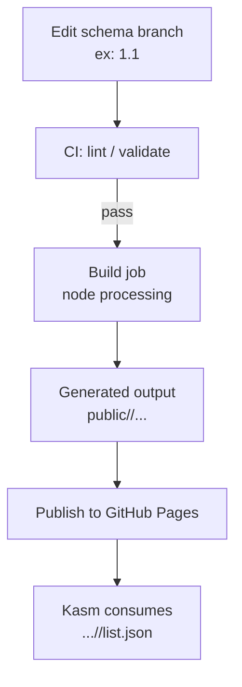

# Build Pipeline

This repo is a **static Kasm Workspace Registry** that publishes versioned registry output to GitHub Pages (e.g. `/1.1/`).

The pipeline’s job is to:

1. **Validate** changes (lint / JSON validity / schema checks)
2. **Build** the static registry output (e.g. `node processing`)
3. **Publish** the generated output to GitHub Pages

> If you’re troubleshooting “Invalid schema list” errors, the two files that usually matter most are:
> - `list.json` (the registry list)
> - `workspaces/*.json` (workspace definitions that get compiled into the list)

---

## High-level flow



---

## Stages

### 1) Lint / Gate
Runs on PRs (and usually again on `main`) to catch issues early:
- JSON validity (no trailing commas, valid syntax)
- Optional schema validation
- Repo-specific lint rules

**Goal:** fail fast before publishing broken output.

### 2) Build
Build takes a schema branch (example `1.1`) and runs the generator to produce the static registry output.

**Inputs**
- Schema branch contents (workspace JSON, templates/assets, etc.)
- Generator script (commonly `processing`)

**Outputs (typical)**
- `list.json`
- `workspaces/*.json`
- icons/images referenced by `image_src`
- any static UI assets you ship

### 3) Publish
Publishes the build output to GitHub Pages so it’s accessible at a stable URL.

**Goal:** Pages always serves a consistent, complete static output for the schema version(s).

---

## Quick local sanity check

From repo root (adjust paths to match your repo):

```bash
# checkout the schema branch you want to build
git checkout 1.1

# install deps if needed
npm ci

# run the generator (whatever your repo uses)
node processing

# confirm expected outputs exist
ls -la public/1.1/ || true
ls -la public/1.1/list.json || true
```

---

## Common failure modes

### Trailing slash on list.json
Kasm expects `.../list.json` (no extra `/` after it). Registering `.../list.json/` can be rejected.

### list.json exists but schema list is invalid
Usually caused by:
- malformed workspace JSON
- missing required fields in a workspace
- generator placing output somewhere different than Pages serves

### GitHub Pages subpath mismatch
If your Pages URL is:
- `https://<org>.github.io/<repo>/1.1/list.json`

…then your generator must output into that exact subpath structure.

---

## Included diagram asset
See `pipeline_diagram.png` (included alongside this doc in the zip).
